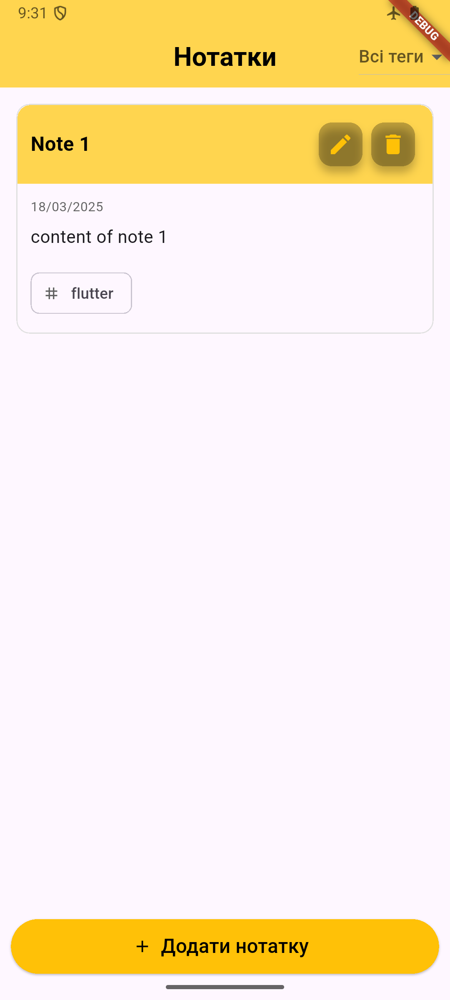

# notes_app

Notes App

A simple and elegant notes application built with Flutter that allows users to create, edit, and organize notes with tags.

## Features

- Create and edit notes with titles and content
- Add tags to categorize notes
- Filter notes by tags
- Clean and intuitive user interface
- Material Design with a pleasant green theme
- Error handling with user-friendly messages
- Responsive layout

## Screenshots

Here's a preview of the Notes App:

